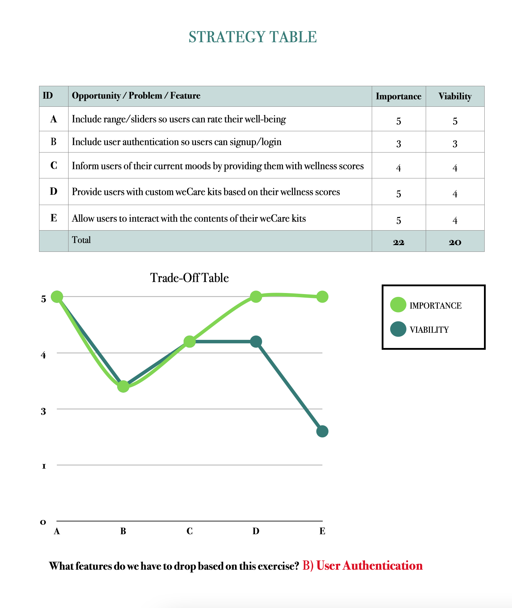

# wEcare

wEcare is a web application that is being built as a tool that business professionals (ages 24-36) can use to assess & improve their mental & emotional well-being in the workplace. 

weCare is being specially designed & developed in conjuction with the [Trust in Soda January 2022 Code Institute Hackathon](https://hackathon.codeinstitute.net/hackathon/16/). The theme for this hackathon is 'Accelerating the Future of Workforce Well-Being and Miindfulness" and weCare is proud to provide a platform that will help young professionals improve their mental wellbeing in the workplace.

***

## UX

The goal of weCare is to provide a front-end web application that will assess & improve the mental & emotional well-being of young professionals in the workplace.

In order to determine the features for this web application, our team conducted the following trade-off activity:

***Please note: the users mentioned in the below user needs table include***:

1) The **user**: young professionals in the workplace that will be using this product
2) The **customer**: The business' (user's employers) that will be administering this product to their employees

The final version of this website will allow weCare to achieve its' goals by implementing software solutions that address the following **user needs**:

| ID | ROLE | ACTION | GOAL | STATUS |
|-----------------|:-------------|:---------------:|---------------:| ---------------:|
| 1 | USER | As a user, I want to be able to rate my mindfulness | So I can receive my custom eCare package | Incomplete |
| 2 | USER | As a user, I want to be able to view my weCare wellness scores | So I can understand my mental well-being and weCare package items | Incomplete |
| 3 | USER | As a user, I want to be able to select one of the activities in my care package | So I can complete the activity I feel I need the most | Incomplete |
| 4 | USER | As a user, I want to be able to complete the activities in my care package | So I can use the wellness materials provided for me | Incomplete |
| 5 | USER | As a user, I want to be able to complete the activities in my care package | So I can use the wellness materials provided for me | Incomplete |
| 6 | CUSTOMER | As a customer, I want to provide a fun, uplifting program | So the mental health needs of my employees can be addressed | Incomplete |
| 7 | CUSTOMER | As a customer, I want weCare to provide additional resources | So my employees can access emergency mental health services if needed | Incomplete |
| 8 | CUSTOMER | As a customer, I want the product to be easy to navigate | So my employees can use it easily | Incomplete |
| 9 | CUSTOMER | As a customer, I want the product to include appropriate content | So my employees will have a positive experience using it | Incomplete |
| 10 | CUSTOMER | As a customer, I want the product to target the needs of specific users | So all employees will have a positive experience using it | Incomplete |