# wEshare

The wEshare application is a messaging platform that is being built for young professionals (ages 24-36). The purpose of weShare is to provide a safe, online community where employees can discuss mental health and wellness issues in the workplace. The key features of the platform are:

weCare is being specially designed & developed in conjuction with the [Trust in Soda January 2022 Code Institute Hackathon](https://hackathon.codeinstitute.net/hackathon/16/). The theme for this hackathon is 'Accelerating the Future of Workforce Well-Being and Miindfulness" and weCare is proud to provide a platform that will help young professionals improve their mental wellbeing in the workplace.

***

## UX

### Features

The goal of wShare is to provide a full-stack application that workplace professionals can use to communicate with each other about mental health, wellness and other personal issues.

In order to determine the features for this web application, our team conducted the following trade-off activity:

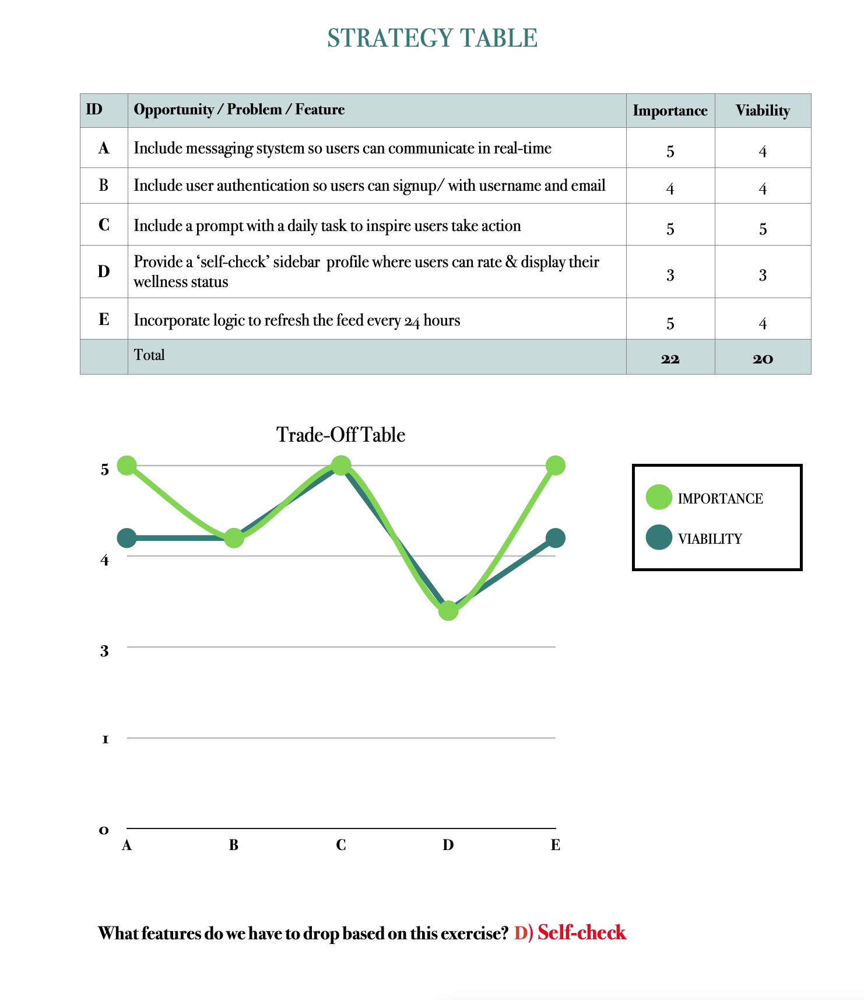

***

### User Stories

User stories have been compiled by the development team to help prepare & plan our sprint schedule.

The final version of this website will allow weShare to achieve its' goals by implementing software solutions that address the **user needs** defined in the table below. 

***Please note: the users mentioned in the below user needs table include***:

1) The **user**: young professionals in the workplace that will be using this product
2) The **customer**: The business' (user's employers) that will be administering this product to their employees

#### **User Needs Table**

| ID | ROLE | ACTION | GOAL | STATUS |
|-----------------|:-------------|:---------------:|---------------:| ---------------:|
| 1 | USER | As a user, I want access to a workplace safe space | So I can share my thoughts with others | Incomplete |
| 2 | USER | As a user, I want to select how I feel that day | So I can share how I feel with others | Incomplete |
| 3 | USER | As a user, I want the option to post in a safe space | So I can unburden myself  | Incomplete |
| 4 | USER | As a user, I want to be able to complete the daily activity | So I can use the wellness materials provided for me | Incomplete |
| 5 | CUSTOMER | As a customer, I want to provide a safe space | So the mental health needs of my employees can be addressed | Incomplete |
| 7 | CUSTOMER | As a customer, I want the product to be easy to navigate | So my employees can use it easily | Incomplete |
| 8 | CUSTOMER | As a customer, I want the product to include appropriate content | So my employees will have a positive experience using it | Incomplete |
| 9 | CUSTOMER | As a customer, I want the product to target the needs of specific users | So all employees will have a positive experience using it | Incomplete |

### Wireframes

<b>Desktop Wireframes</b>

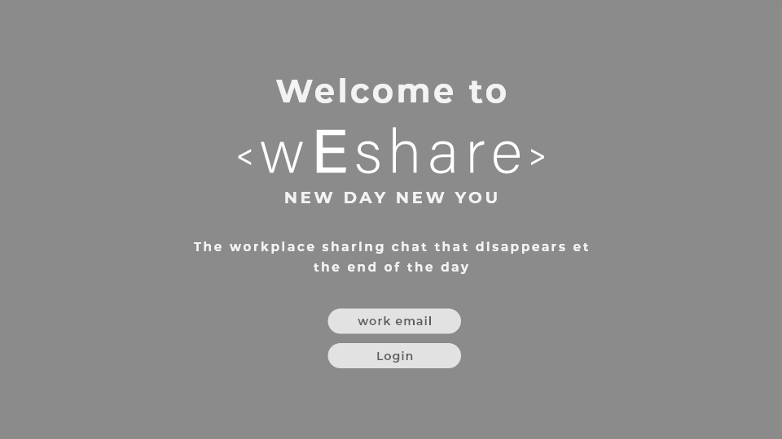

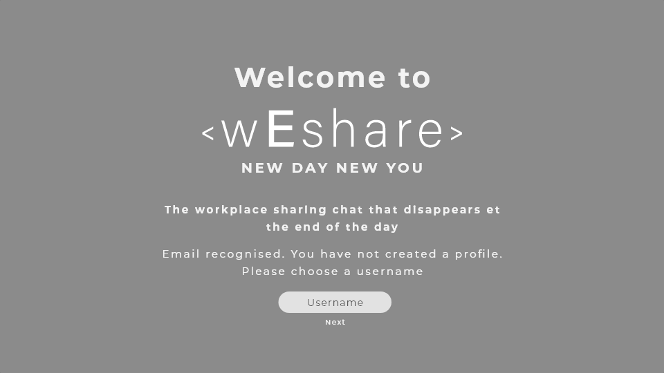

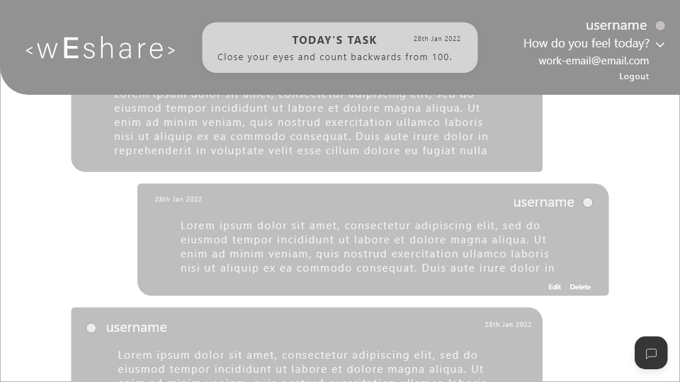

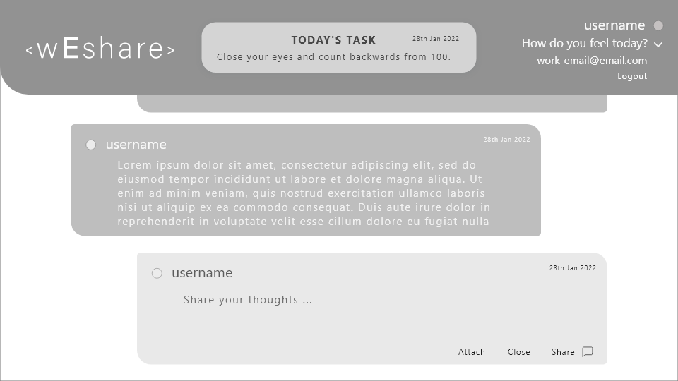

<b>Tablet Wireframes</b>

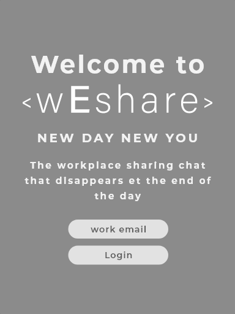

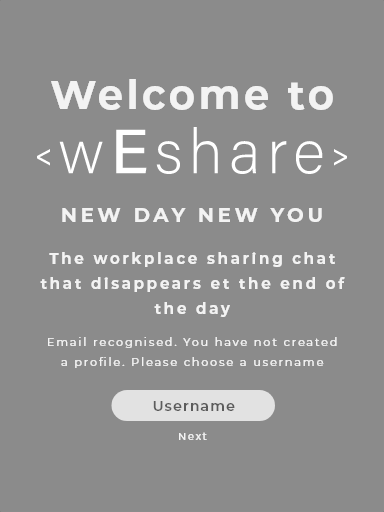

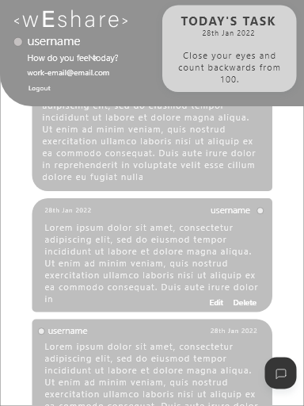

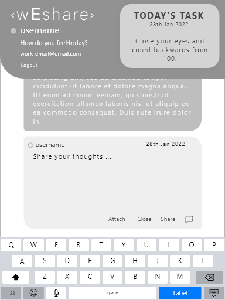

<b>Mobile Wireframes</b>

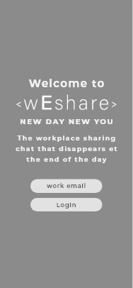

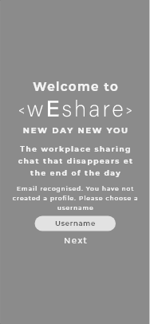

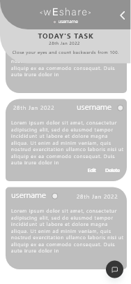

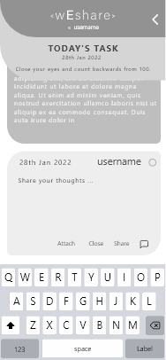

## CREDITS

- https://coderwall.com/p/aey-rq/django-allauth-quick-setup

- Code for background gradient sourced from https://www.sliderrevolution.com/resources/css-animated-background/